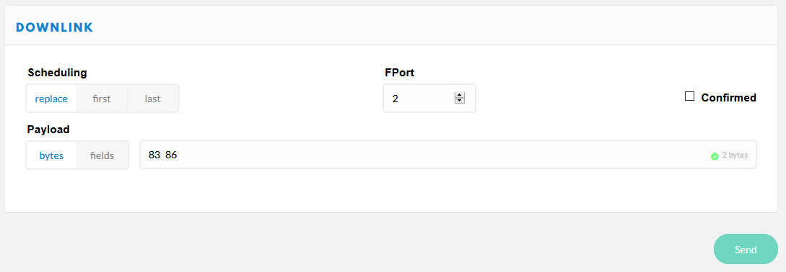

# Remote control

The device listenes for remote control commands on LoRaWAN Port 2. Multiple commands per downlink are possible by concatenating them, but must not exceed a maximum of 10 bytes per downlink.

!!! info
	Settings can be stored in NVRAM to make them persistant (reloaded during device startup / restart). To store settings, use command `0x21`.

Send for example `83` `86` as Downlink on Port 2 to get battery status and time/date from the device.

#### 0x01 set scan RSSI limit

	1 ... 255 used for wifi and bluetooth scan radius (greater values increase scan radius, values 50...110 make sense)
	0 = RSSI limiter disabled [default]

#### 0x02 set counter mode

	0 = cyclic unconfirmed, mac counter reset after each wifi scan cycle, data is sent only once [default]
	1 = cumulative counter, mac counter is never reset
	2 = cyclic confirmed, like 0 but data is resent until confirmation by network received

#### 0x03 set GPS data on/off

	0 = GPS data off
	1 = GPS data on, sends GPS data on port 4 (default, use port 1 for mobile pax counter), if GPS is present and has a fix

#### 0x04 set display on/off

	0 = display off
	1 = display on [default]

#### 0x05 set LoRa datarate

	0 ... 15 see LoRaWAN regional parameters for details [default: 5]

	Example for EU868:

	DataRate	Configuration			Bit/s
	0			LoRa: SF12 / 125 kHz	250
	1			LoRa: SF11 / 125 kHz	440
	2			LoRa: SF10 / 125 kHz	980
	3			LoRa: SF9 / 125 kHz		1760
	4			LoRa: SF8 / 125 kHz		3125
	5			LoRa: SF7 / 125 kHz		5470
	6*			LoRa: SF7 / 250 kHz		11000
	7*			FSK: 50 kbps			50000
	8 .. 14		reserved for future use (RFU)
	15			ignored (device keeps current setting)

	*) not supported by TheThingsNetwork

#### 0x06 set LoRa TXpower

	0 ... 255 desired TX power in dBm [default: 14]

#### 0x07 set LoRa Adaptive Data Rate mode

	0 = ADR off
	1 = ADR on [default]

	If ADR is set to off, SF value is shown inverted on display.

#### 0x08 do nothing

	useful to clear pending commands from LoRaWAN server quere, or to check RSSI on device

#### 0x09 reset functions (send this command UNconfirmed only to avoid boot loops!)

	0 = restart device (coldstart)
	1 = (reserved, currently does nothing)
	2 = reset device to factory settings and restart device
	3 = flush send queues
	4 = restart device (warmstart)
	8 = reboot device to maintenance mode (local web server)
	9 = reboot device to OTA update via Wifi mode

#### 0x0A set payload send cycle

	5 ... 255 payload send cycle in seconds/2
	e.g. 120 -> payload is transmitted each 240 seconds [default]

#### 0x0B set Wifi channel hopping interval timer

	0 ... 255 duration for scanning a wifi channel in seconds/100
	e.g. 50 -> each channel is scanned for 500 milliseconds [default]
	0 means no hopping, scanning on fixed single channel WIFI_CHANNEL_1

#### 0x0C set Bluetooth channel switch interval timer

	0 ... 255 duration for scanning a bluetooth advertising channel in seconds/100
	e.g. 8 -> each channel is scanned for 80 milliseconds [default]

#### 0x0E set Bluetooth scanner

	0 = disabled
	1 = enabled [default]

#### 0x0F set WIFI antenna switch (works on LoPy/LoPy4/FiPy only)

	0 = internal antenna [default]
	1 = external antenna

#### 0x10 set RGB led luminosity (works on LoPy/LoPy4/FiPy and LoRaNode32 shield only)

	0 ... 100 percentage of luminosity (100% = full light)
	e.g. 50 -> 50% of luminosity [default]

#### 0x13 set user sensor mode

	byte 1 = user sensor number (1..3)
	byte 2 = sensor mode (0 = disabled / 1 = enabled [default])

#### 0x14 set payload mask

	byte 1 = sensor data payload mask (0..255, meaning of bits see below)
        0x01 = COUNT_DATA
        0x02 = RESERVED_DATA
        0x04 = MEMS_DATA
        0x08 = GPS_DATA
        0x10 = SENSOR_1_DATA
        0x20 = SENSOR_2_DATA
        0x40 = SENSOR_3_DATA
        0x80 = BATT_DATA
    bytes can be combined eg COUNT_DATA + SENSOR_1_DATA + BATT_DATA: `0x01 | 0x10 | 0x80 = 0x91`

#### 0x15 set BME data on/off

	0 = BME data off
	1 = BME data on, sends BME data on port 7 [default]

#### 0x16 set battery data on/off

	0 = battery data off [default]
	1 = battery data on, sends voltage on port 8

#### 0x17 set Wifi scanner

	0 = disabled
	1 = enabled [default]

#### 0x18 reserved

    unused, does nothing

#### 0x19 set sleep cycle

	bytes 1..2 = device sleep cycle in seconds/10 (MSB), 0..65535 (0 = no sleep)
	e.g. {0x04, 0xB0} -> device sleeps 200 minutes after each send cycle [default = 0]

#### 0x20 load device configuration

	Current device runtime configuration will be loaded from NVRAM, replacing current settings immediately (use with care!)

#### 0x21 store device configuration

	Current device runtime configuration is stored in NVRAM, will be reloaded after restart

#### 0x80 get device configuration

	Device answers with it's current configuration on Port 3.

#### 0x81 get device status

	Device answers with it's current status on Port 2.

#### 0x83 get battery status

	Device answers with battery voltage on Port 8.

#### 0x84 get device GPS status

	Device answers with it's current status on Port 4.

#### 0x85 get BME280 / BME680 sensor data

	Device answers with BME sensor data set on Port 7.

#### 0x86 get time/date

	Device answers with it's current time on Port 2:

	bytes 1..4 = time/date in UTC epoch seconds (LSB)
	byte 5 = time source & status, see below

		bits 0..3 time source
			0x00 = GPS
			0x01 = RTC
			0x02 = LORA
			0x03 = unsynched
			0x04 = set (source unknown)

		bits 4..7 esp32 sntp time status
			0x00 = SNTP_SYNC_STATUS_RESET
			0x01 = SNTP_SYNC_STATUS_COMPLETED
			0x02 = SNTP_SYNC_STATUS_IN_PROGRESS

#### 0x87 sync time/date

	Device synchronizes it's time/date by calling the preconfigured time source.

#### 0x88 set time/date

	bytes 1..4 = time/date to set in UTC epoch seconds (MSB, e.g. https://www.epochconverter.com/hex)